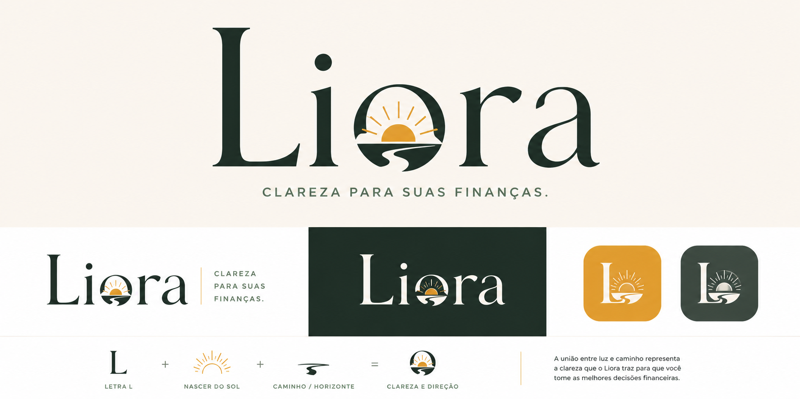

# 🌅 Liora

<p align="center">
  
</p>

<p align="center">
  <strong>Clareza para suas finanças.</strong>
</p>

<p align="center">
  <a href="https://controle-de-gastos-phi-dun.vercel.app" target="_blank">
    
  </a>
</p>

<p align="center">
  
  
  
  
</p>

---

## 📖 A história por trás do projeto

A Liora nasceu da necessidade de substituir uma planilha de Excel usada para controlar gastos pessoais. A ideia não era criar um banco digital, uma fintech ou um dashboard corporativo, mas uma ferramenta simples e elegante para responder uma pergunta prática:

> Para onde meu dinheiro está indo neste mês?

O projeto foi evoluindo de um controle básico de lançamentos para uma aplicação com dashboard mensal, histórico, categorias, tela de salário, cálculo de saldo do salário e suporte offline como PWA.

Liora significa luz, clareza e equilíbrio. Essa direção guia tanto a interface quanto a organização do código.

---

## ✨ Funcionalidades

* 📊 Dashboard mensal com total gasto, saldo restante, maior categoria e média mensal
* 💸 Cadastro de gastos com data, categoria, valor e descrição opcional
* ✏️ Edição e exclusão de lançamentos
* 🔎 Pesquisa dinâmica por descrição, categoria ou valor
* 🏷️ Gerenciamento de categorias ativas e inativas
* 📅 Histórico completo com filtros por mês e categoria
* 🗂️ Arquivo de meses anteriores já encerrados
* 💼 Tela de salário mensal editável
* 🧮 Cálculo do que sobra do salário diante dos gastos do mês
* 📱 Layout responsivo para desktop, tablet e celular
* 🌐 PWA com suporte offline após o primeiro carregamento

---

## 🖼️ Demonstração

<p align="center">
  
</p>

<p align="center">
  <strong>Direção visual:</strong> tema escuro, grade fina, painéis retangulares, contraste alto e foco na leitura financeira.
</p>

---

## 🧭 Experiência interativa

<details open>
  <summary><strong>🌅 Caminho visual da Liora</strong></summary>

A interface segue o modelo visual do repositório `winged-lion`, com fundo preto em grade, painéis quase pretos, textura diagonal discreta, bordas secas e tipografia condensada em controles e rótulos.

O objetivo é fazer o usuário sentir que está abrindo uma ferramenta pessoal de organização, não um painel bancário.
</details>

<details>
  <summary><strong>📍 Rotas principais</strong></summary>

* `/painel`: dashboard mensal
* `/gastos`: cadastro, edição, exclusão, pesquisa e filtros
* `/historico`: meses anteriores
* `/configuracoes`: salário e categorias
</details>

<details>
  <summary><strong>💾 Dados locais e privacidade</strong></summary>

Os dados ficam salvos no navegador do próprio dispositivo usando `localStorage`. Nenhuma informação é enviada para servidores externos nesta versão.

Se os dados do navegador forem apagados, os lançamentos podem ser perdidos. Nesta versão, os dados continuam locais no próprio dispositivo.
</details>

<details>
  <summary><strong>🎨 Design system</strong></summary>

A identidade visual está centralizada em tokens CSS e estilos globais:

* `src/styles/tokens.css`
* `src/estilos/global.css`

A proposta visual atual prioriza superfícies escuras, hierarquia forte nos valores financeiros, botões retangulares, bordas de 2px e separação objetiva entre seções.
</details>

---

## 🛠️ Tecnologias utilizadas

<p align="center">
  
</p>

* React 19
* Vite 8
* TypeScript
* CSS organizado por componentes
* CSS variables para tokens visuais
* React Router DOM
* Lucide React
* LocalStorage
* Manifest e Service Worker para PWA

---

## 🚀 Como executar o projeto

```bash
# Clone o repositório
git clone https://github.com/Luis-Fernando-R-Bueno/Controle-de-gastos.git

# Acesse a pasta do projeto
cd Controle-de-gastos

# Instale as dependências
npm install

# Execute a aplicação
npm run dev
```

A aplicação abre em modo desenvolvimento no endereço indicado pelo Vite, normalmente:

```txt
http://localhost:5173
```

Para gerar a versão de produção:

```bash
npm run build
```

---

## 📂 Estrutura do projeto

```text
Liora/
├── docs/
│   ├── projeto.md
│   └── desenho da api.md
├── public/
│   ├── favicon.svg
│   ├── liora-conceito.png
│   ├── liora-logo.svg
│   ├── manifest.webmanifest
│   └── sw.js
└── src/
    ├── componentes/
    ├── estilos/
    ├── hooks/
    ├── pwa/
    ├── rotas/
    ├── servicos/
    ├── styles/
    ├── telas/
    └── utils/
```

---

## 🌱 Próximas funcionalidades

* 📈 Melhorar gráficos e análises mensais
* 📤 Ampliar exportações de relatórios
* 🗄️ Avaliar IndexedDB para persistência local mais robusta
* 📲 Preparar empacotamento futuro como app mobile ou WebView
* 🔐 Evoluir autenticação se houver back-end no futuro
* ☁️ Avaliar sincronização entre dispositivos somente em uma versão posterior

---

## 📚 Documentação complementar

* [`docs/projeto.md`](./docs/projeto.md): ideia, histórico de evolução e decisões do sistema
* [`docs/desenho da api.md`](./docs/desenho%20da%20api.md): modelagem descritiva para uma futura persistência local estruturada
* [`README-vite.md`](./README-vite.md): documentação original do template Vite preservada como referência

---

## 👨‍💻 Autor

Desenvolvido por **Luis Fernando Rodrigues Bueno**.

Se este projeto foi útil ou interessante para você, deixe uma ⭐ no repositório.
